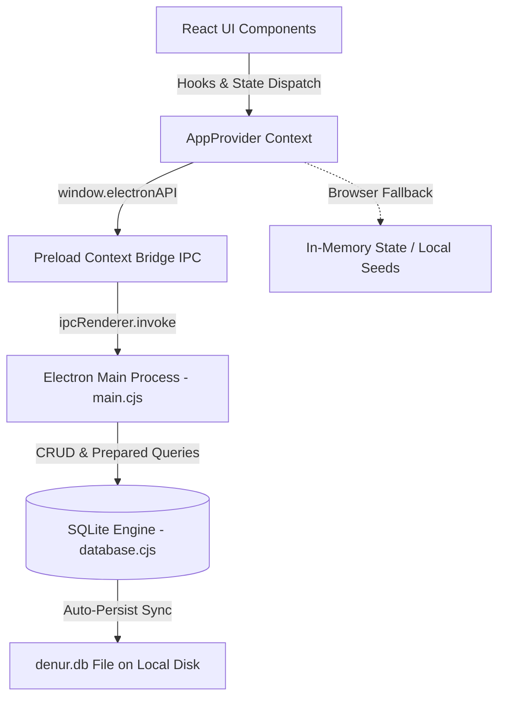

# 🧺Laundry POS By Hadrex

<div align="center">


<br/>
**A Modern, High-Performance Point of Sale (POS) and Operations Management System for Laundries & Dry Cleaners.**

<br/>

[](https://react.dev/)
[](https://www.typescriptlang.org/)
[](https://vitejs.dev/)
[](https://www.electronjs.org/)
[](https://tailwindcss.com/)
[-003B57?style=flat-square&logo=sqlite&logoColor=white)](https://sql.js.org/)
[](#)
[](#-license--attributions)

</div>

---

## 📑 Table of Contents

1. [Overview](#-overview)
2. [Key Features & Modules](#-key-features--modules)
3. [Tech Stack](#-tech-stack)
4. [Project Architecture & Directory Structure](#-project-architecture--directory-structure)
5. [Database & Data Flow](#-database--data-flow)
6. [Getting Started & Installation](#-getting-started--installation)
7. [Production Build & Packaging](#-production-build--packaging)
8. [Thermal Printing & Invoicing](#-thermal-printing--invoicing)
9. [License & Attributions](#-license--attributions)

---

## 🌟 Overview

**Laundry POS** is a full-featured Point of Sale (POS) and operational enterprise application tailored specifically for commercial laundries, dry cleaners, ironing stations, and garment/shoe care facilities.

The system is built from the ground up to provide an intuitive, high-speed user experience with complete **Right-to-Left (RTL)** Arabic localization and support for dual runtime environments:

1. **Standalone Desktop Application (Offline-First)**: Powered by **Electron** and an embedded **SQLite (`sql.js`)** engine that runs locally with instant disk persistence, requiring zero internet connectivity for continuous cashier operation.
2. **Interactive Web Application**: Can be deployed and accessed via modern web browsers over local networks (LAN) or cloud environments.

---

## 🚀 Key Features & Modules

### 1. ⚡ Fast Point of Sale & Checkout (معاملة جديدة)
- **Visual Service Catalog**: Categorized services with distinct color codes and icons for swift item selection.
- **Dynamic Pricing Engine**: Flexible pricing per unit (Kilogram, Piece, Pair, Unit) supporting decimal weights and custom item quantities.
- **Instant Customer Lookup & Quick Registration**: Search registered customers by name/phone or create a new customer on the fly right from the checkout drawer.
- **Multi-Payment Methods**: Support for Cash, Bank Cards, and Electronic Transfers with automated change and balance calculation.
- **Instant Thermal Receipt Generation**: Formatted for standard 58mm/80mm thermal printers with sequential order IDs (`DNR-0001`), line items, taxes, notes, and barcodes.

### 2. 📋 Order Management & Workflow Tracking (إدارة الطلبات)
- **Visual Order Lifecycle Stages**:
  - 🟡 **Waiting (`menunggu`)**: Order received and queued for washing/ironing.
  - 🔵 **Processing (`proses`)**: Order actively undergoing washing, drying, or pressing.
  - 🟢 **Completed (`selesai`)**: Cleaned, packed, and ready for customer pickup.
  - 🔴 **Canceled (`batal`)**: Order canceled with automated revenue recalculation.
- **Payment Status Tracking**: Toggle paid/unpaid status with a single click.
- **Advanced Filtering & Search**: Instant real-time search by order code, customer name, or phone number.
- **CSV Data Export**: Export filtered or complete order records for accounting and spreadsheet reporting.

### 3. 👥 Customer Relationship Management (CRM) (العملاء)
- Comprehensive customer database capturing name, phone number, email, address, and join date.
- Real-time customer statistics: Lifetime orders count, total expenditure (LTV), and last visit date.
- One-click order creation linked directly to a selected customer profile.
- Edit, delete, toggle active status, and export customer directories to CSV.

### 4. 👔 Services & Pricing Configuration (الخدمات والأسعار)
- Manage full catalog of garment care services (Dry Cleaning, Wet Wash, Steam Press / Ironing, Wash & Iron Combo, Express 6-Hour, Chemical Stain Removal, Premium Shoe Cleaning).
- Configure unit types (`kg`, `liter`, `piece`, `pair`), base price, and turnaround duration (hours/days).
- Real-time service activation/deactivation and custom UI badge color assignment.

### 5. 📦 Inventory & Supplies Management (المخزون والمواد)
- **Categorized Material Tracking**:
  - 🧪 **Detergents & Chemicals**: Powders, liquid detergents, bleaching agents, stain removers.
  - 🌸 **Fragrances & Softeners**: Lavender fabric softeners, scent enhancers.
  - 🛍️ **Packaging Supplies**: Garment polybags, wire/plastic hangers, 58mm thermal paper rolls.
  - ⚙️ **Equipment & Machinery**: Front-load commercial washers, industrial steam irons, digital scales.
- **Low-Stock Alert Badges**: Automated visual warnings when stock levels breach predefined minimum thresholds.
- **Stock Movement Log (Stock History)**: Inbound (Restock / إدخال) and Outbound (Consumption / استهلاك) audit logs with running balance (`saldo`) calculations.
- **Automatic SKU Generator**: Generates formatted SKUs by category (`BHN-001`, `BWG-001`, `PKG-001`, `ALT-001`).

### 6. 💰 Treasury & Cash Register Drawer (الخزينة)
- Record daily cash deposits (إيداع / Cash In) and withdrawals (سحب / Cash Out).
- Assign cash movements to responsible employees with mandatory reason logging.
- Audit real-time petty cash balances to ensure accurate end-of-day register balancing.

### 7. 📊 Analytics, Charts & Reports (التقارير والإحصائيات)
- **Key Performance Indicators (KPIs)**: Today's Revenue, Monthly Orders Count, Active Orders in Queue, and Total Registered Customers with week-over-week growth percentages.
- **Interactive Weekly Area Chart**: Visualize daily revenue versus transaction volume trends powered by Recharts.
- **Service Distribution Breakdown**: Interactive pie chart displaying market share and percentage breakdown for each service category.
- **Monthly Revenue & Orders Table**: Historical performance metrics with CSV export.

### 8. ⚙️ System Settings & Customization (الإعدادات)
- **Store Identity & Profile**: Store name, address, contact phone, and tax percentage.
- **Multi-Currency Support**: Switch seamlessly between currencies (`ج.م`, `SAR`, `AED`, `USD`, `EUR`, `IDR`, etc.).
- **Thermal Printer Settings**: Enable/disable auto-printing on checkout, configure receipt width (58mm / 80mm).
- **Safe Database Factory Reset**: Re-seeds default system services, inventory items, and test accounts with a single administrative action.

---

## 🛠️ Tech Stack

| Layer | Technology | Purpose |
| :--- | :--- | :--- |
| **Frontend Framework** | `React 18.3.1` | Declarative, component-based user interface |
| **Language** | `TypeScript 5.x` | Strict type safety, clean entity models, and maintainability |
| **Build Tool** | `Vite 6.3.5` | Ultra-fast HMR and optimized production bundling |
| **Desktop Runtime** | `Electron 43.4.0` | Cross-platform desktop shell for Windows, macOS, and Linux |
| **Desktop Packager** | `electron-builder 26.x` | Production installer generator (`.exe` NSIS, AppImage, DMG) |
| **Styling & CSS** | `Tailwind CSS v4.1` | Modern tokenized utility styling and theme management |
| **UI Primitives** | `@radix-ui/*` & `shadcn/ui` | Accessible, unstyled UI primitives (Dialogs, Menus, Selects) |
| **Database Engine** | `sql.js` (SQLite WASM) | Serverless, standalone relational SQLite database engine |
| **Charts & Visualizations** | `recharts 2.15.2` | Composable, responsive charts for revenue and analytics |
| **Icons** | `lucide-react 0.487` | Lightweight, scalable vector icons |
| **Toast Notifications** | `sonner 2.0.3` | Sleek, non-blocking toast notifications |
| **Date & String Utilities** | `date-fns`, `clsx`, `tailwind-merge` | Date formatting and conditional CSS class merging |

---

## 📁 Project Architecture & Directory Structure

```text
Laundry-POS/
├── .git/                      # Git version control repository
├── .gitignore                 # Excluded build artifacts, databases, and dependencies
├── package.json               # Project manifest, scripts, and dependency tree
├── pnpm-workspace.yaml        # pnpm workspace configuration
├── vite.config.ts             # Vite configuration, path aliases (@/), and asset handling
├── electron-builder.json      # Desktop distribution and NSIS installer configuration
├── postcss.config.mjs         # PostCSS configuration
├── index.html                 # Main HTML entry point configured for RTL layout
├── ATTRIBUTIONS.md            # Component and asset license attributions
├── DESIGN_SYSTEM_AND_COMPONENTS.md # Design tokens and shadcn component specifications
│
├── electron/                  # Electron Main Process & Native Backend
│   ├── main.cjs               # Main process, window lifecycle, and IPC handlers
│   ├── preload.cjs            # Secure context isolation bridge (electronAPI)
│   └── database.cjs           # SQLite database schema, CRUD operations, and reporting
│
└── src/                       # Frontend Application Source Code
    ├── main.tsx               # React application mounting point
    │
    ├── types/                 # TypeScript interfaces and entity types
    │   └── index.ts           # Order, Customer, ServiceItem, InventoryItem, AppCtx, etc.
    │
    ├── db/                    # Default initial data and seeds
    │   └── seed.ts            # Seed items for services, inventory, and test users
    │
    ├── styles/                # CSS Stylesheets and theme tokens
    │   ├── fonts.css          # IBM Plex Sans Arabic & IBM Plex Mono font imports
    │   ├── theme.css          # Color variables and dark/light mode tokens
    │   ├── globals.css        # Global CSS resets
    │   └── index.css          # Master stylesheet entry point
    │
    └── app/                   # Application Core & UI Views
        ├── App.tsx            # Main application layout, sidebar navigation, and views
        ├── AppProvider.tsx    # State management provider with SQLite IPC / Web sync
        └── components/        # UI Component Library
            ├── ui/            # Prebuilt UI components (Buttons, Dialogs, Tables, Inputs)
            └── figma/         # Helper components (ImageWithFallback)
```

---

## 🗄️ Database & Data Flow

When running in Electron, the application persists all data into a local SQLite database file (`denur.db`) located in the user data directory (`app.getPath("userData")/denur.db`):



### Database Schema Overview:
- `orders`: Transactions, customer names, phone, service name, weight/qty, total, status, timestamp, payment state, and notes.
- `customers`: Customer profiles, contact details, total orders, total spend, join date, and active status.
- `services`: Service catalog, description, unit price, measurement unit, completion duration, color tag, and active flag.
- `inventory`: Stock items, SKU, category, measurement unit, current quantity, minimum threshold, cost, supplier, and icon.
- `stock_history`: Full audit trail of stock replenishment and usage with running balance (`saldo`).
- `treasury`: Cashbox movements (deposits/withdrawals), amounts, timestamps, employee names, and transaction reasons.
- `settings`: Key-value configuration pairs (currency, store name, tax rate, auto-print preferences).

---

## 💻 Getting Started & Installation

### Prerequisites:
- **Node.js**: Version 18.x or later installed.
- **Package Manager**: `npm`, `pnpm`, or `yarn`.

### 1. Clone & Install Dependencies:
```bash
# Clone the repository
git clone https://github.com/ahmedelhaddad-0/Laundry-POS.git

# Navigate into project directory
cd Laundry-POS

# Install dependencies using npm
npm install

# Or using pnpm
pnpm install
```

### 2. Run in Web Development Mode:
Launches the Vite local development server:
```bash
npm run dev
```
Open your browser and navigate to: `http://localhost:5173`

### 3. Run in Electron Desktop Mode:
Starts the application as a native desktop window with full SQLite database integration:
```bash
npm run electron
```

---

## 📦 Production Build & Packaging

### Build Web Production Bundle:
```bash
npm run build
```
Optimized assets will be generated in the `dist/` directory.

### Build Electron Desktop Installer:
Compiles frontend assets and packages an installer executable (`.exe` NSIS installer for Windows, or DMG/AppImage for macOS/Linux):
```bash
npm run build:electron
```
The final standalone installer will be output to the `release/` directory.

---

## 🖨️ Thermal Printing & Invoicing

- Designed specifically for standard **58mm** and **80mm** thermal POS receipt printers.
- **Receipt Content**:
  - Store Header and contact information.
  - Unique Order ID, barcode, reception, and estimated pickup date/time.
  - Itemized service details, weights/quantities, unit prices, and subtotals.
  - Tax calculation, total amount paid, and outstanding balance.
  - Terms of service, pickup policies, and barcode tags.
- Direct one-click printing via standard OS print dialogs, with optional automatic printing upon checkout confirmation.

---

## 📄 License & Attributions

- **License**: Released under the [MIT License](https://opensource.org/licenses/MIT).
- **UI Components**: Built using [shadcn/ui](https://ui.shadcn.com/) and [Radix UI](https://www.radix-ui.com/).
- **Typography & Icons**: Powered by [Google Fonts (IBM Plex Sans Arabic)](https://fonts.google.com/) and [Lucide Icons](https://lucide.dev/).

---

<div align="center">
<b>Denur Laundry POS — Empowering Laundry & Garment Care Businesses with Speed, Simplicity, and Precision.</b>
</div>